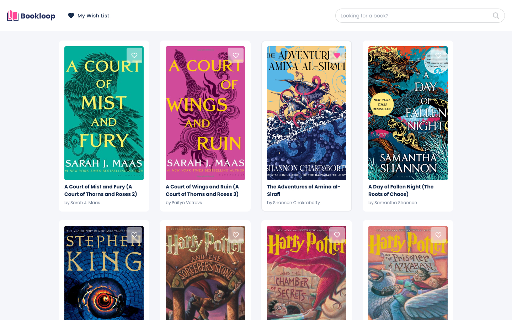
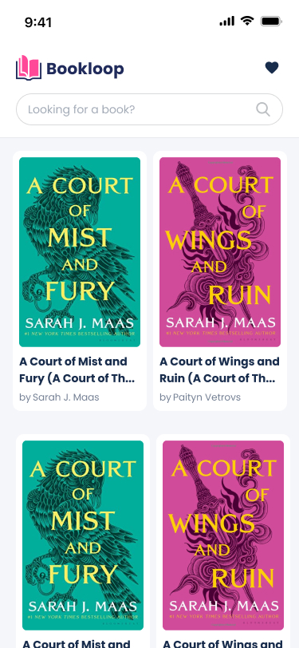

## Frontend Home Assignment

### Objective: 

Create a web project written in typescript using React \
The webapp should be fully responsive & support desktop & mobile devices:

### Working solution:

https://bit.ly/doorloop-assignment

see `shpitz-solution-guidelines.txt`, for explanations

### Requirements:

- App Screen: 
  - TopNavbar
      - Search Input - use debounce to trigger the search as the user types in the field
      - Wishlist button - should filter the books list and show only the wish listed items
      - Fetch books via [Google Books API](https://developers.google.com/books/docs/v1/using#WorkingVolumes)
      - Implement a simple pagination (20 books per page)
  - BooksList
      - Implement the  BookListItem and show the following fields:
          - Book Image
          - Book title
          - Book authors
          - Button for adding books into wishlist - onPress should add the book to the wishlist and save the list in the browser local storage
- Note - All assets are stored in `frontend/src/assets` directory

### Design

### Submission:
- Assignment solution should not be committed to a public repository
- Delete the node_modules folder, zip the solution folder and send it for review via email or via a file sharing software such as Google Drive / Dropbox / etc

## Thanks & good luck!
